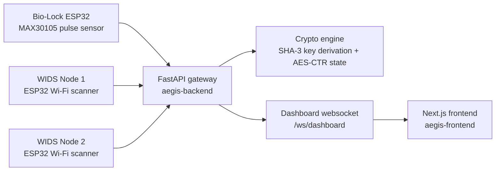

# AEGIS-ZONE

AEGIS-ZONE is a prototype zero-trust workstation that binds access to two live conditions:

1. A valid biometric pulse stream from a dedicated Bio-Lock sensor.
2. A clean physical wireless perimeter observed by two ESP32 WIDS nodes.

When the pulse stream disappears or a nearby untrusted access point crosses the configured RSSI threshold, the backend destroys the active AES session key and the dashboard immediately transitions into lockdown mode.

## System Overview



## What The Prototype Does

- Streams IR pulse data from a MAX30105-based Bio-Lock node over serial.
- Derives a rolling AES key from recent biometric variance using SHA3-256.
- Ingests Wi-Fi sweep data from two ESP32 scanner nodes over WebSocket.
- Flags nearby non-whitelisted SSIDs as threats using differential RSSI data.
- Pushes live system state to a Next.js dashboard with:
  - a biometric waveform panel,
  - a spatial WIDS radar,
  - a secured webcam view that falls back to animated static during lockdown.

## Repository Layout

```text
AEGIS-ZONE/
|-- aegis-backend/
|   |-- main.py
|   |-- crypto_engine.py
|   |-- wids_engine.py
|   `-- requirements.txt
|-- aegis-embedded/
|   |-- bio_lock_node/
|   |-- wids_scanner_node/
|   `-- wids_scanner_node_2/
|-- aegis-frontend/
|   |-- app/
|   |-- components/
|   `-- package.json
|-- Hardware Pics/
|-- Plan.md
|-- Startup.txt
`-- start_aegis.sh
```

## Stack

| Layer | Implementation |
| --- | --- |
| Gateway backend | FastAPI, Uvicorn, PySerial, WebSockets |
| Cryptography | `hashlib` SHA3-256, `cryptography` AES-CTR |
| Frontend | Next.js 16, React 19, Tailwind CSS 4 |
| Embedded nodes | ESP32 / Arduino |
| Biometric sensing | MAX30105 pulse sensor |

## Runtime Flow

### 1. Bio-Lock ingestion

`aegis-backend/main.py` opens the Bio-Lock serial port, reads lines emitted by the sensor node, extracts the `IR=` value, and builds a rolling heartbeat window. Once enough samples exist, the backend calls `CryptoEngine.update_heartbeat(...)`.

### 2. Key derivation and lockdown

`aegis-backend/crypto_engine.py` hashes the latest heartbeat window with SHA3-256 and uses the digest as the AES key. If heartbeat data stops for more than 5 seconds, the key is cleared.

### 3. Wireless intrusion detection

`aegis-backend/wids_engine.py` receives scan payloads from `NODE_1` and `NODE_2`, merges recent observations, and raises a breach if a non-whitelisted SSID is physically close enough to exceed the configured RSSI threshold.

### 4. Dashboard updates

The backend publishes combined system state over `/ws/dashboard`, and the frontend renders the pulse trace, WIDS list, and secure/locked visual state in real time.

## Quick Start

### Backend

```bash
cd aegis-backend
python -m venv venv
venv\Scripts\activate
pip install -r requirements.txt
uvicorn main:app --host 0.0.0.0 --port 8000
```

### Frontend

```bash
cd aegis-frontend
npm install
npm run dev
```

Open `http://localhost:3000`.

## Hardware Nodes

### Bio-Lock node

File: `aegis-embedded/bio_lock_node/bio_lock_node.ino`

- Uses a MAX30105 sensor over I2C.
- Emits raw IR values and derived BPM over serial at `115200`.
- Treats low IR values as "no finger" conditions.

### WIDS nodes

Files:

- `aegis-embedded/wids_scanner_node/wids_scanner_node.ino`
- `aegis-embedded/wids_scanner_node_2/wids_scanner_node_2.ino`

Both nodes:

- join the `Aegis_Hub` Wi-Fi network,
- connect to `ws://192.168.4.1:8000/ws/wids-ingest`,
- scan nearby APs every second,
- send JSON payloads containing `bssid`, `ssid`, and `rssi`.

## Current Prototype Assumptions

- The backend currently auto-selects a serial device using broad CP210/CH340 heuristics and falls back to `COM3` on Windows.
- The frontend defaults to `192.168.137.2:8000` when loaded from `localhost`.
- The WIDS whitelist is hardcoded in `aegis-backend/wids_engine.py`.
- The secure video area is a webcam-backed demo surface rather than a protected application session.

These choices are reasonable for a lab prototype, but they should be externalized into configuration before broader deployment.

## Startup Notes

For the original Raspberry Pi + laptop workflow, see `Startup.txt`. For a combined launch script on Linux/Raspberry Pi, use `start_aegis.sh`.

## Future Improvements

- Externalize runtime configuration using environment variables
- Add persistent threat logging and audit trails
- Improve biometric validation robustness
- Enhance WIDS whitelist management via dashboard controls

## License

This project is intended for academic and prototype demonstration purposes.